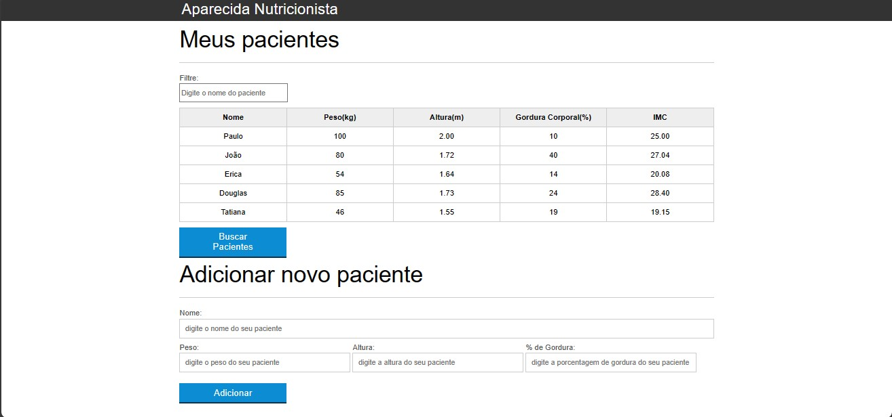

<h1 align="center">Aparecida Nutrição</h1>

  Projeto feito no curso de introdução ao JavaScript na web.

  

## 🚀 Tecnologias

Esse projeto foi desenvolvido com as seguintes tecnologias:

- HTML e CSS
- JavaScript

## 💻 Projeto

- No projeto, é ensinado sobre a lógica da programação com o JavaScript, validação de formulários, filtragem de elementos e etc.

## LINK

- https://cursos.alura.com.br/course/javascript-programando-na-linguagem-web
